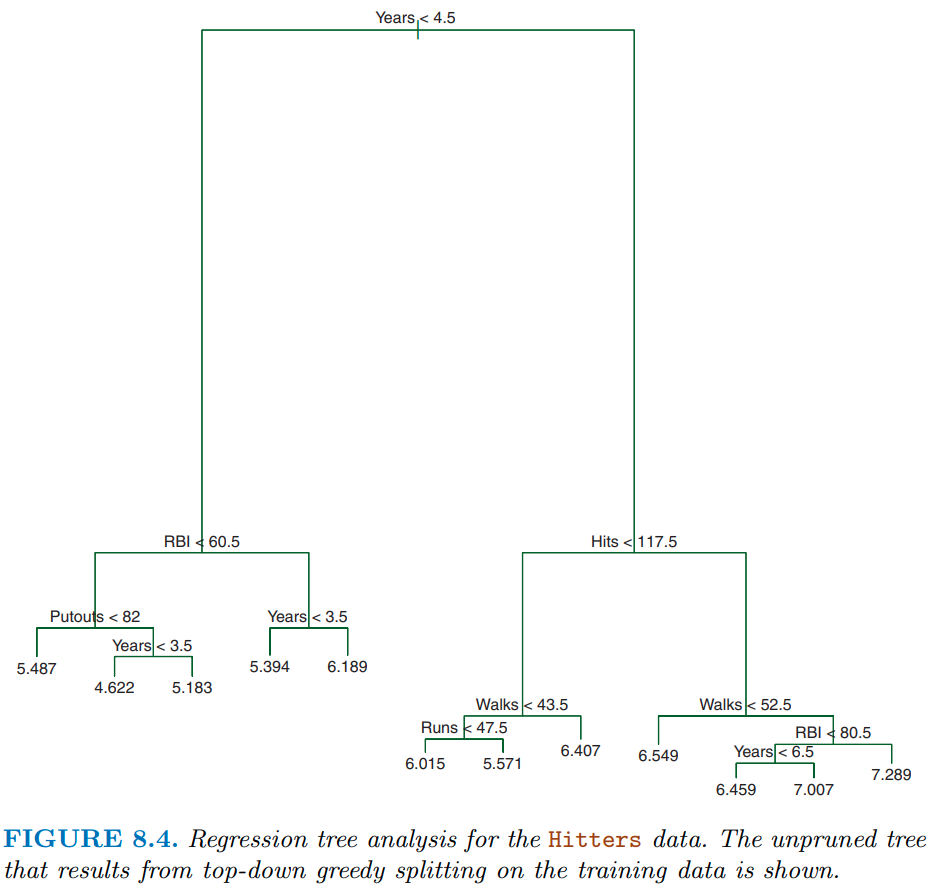

# IAML Unit 9: Discussion

## Announcements

- Code update from keras to brulee by end of day tomorrow 
- Appendix to better understand splits objects and then generalized to applications for nested cross validation
- office hours claimed for student defense.   Available by appt tomorrow and monday.
- running right out to meeting with surgeon after class

--------------------------------------------------------------------------------

## General

- Learn more about the algorithms you use by reading package documentation

  - [ranger](https://cran.r-project.org/web/packages/ranger/index.html)
  - [rpart](https://cran.r-project.org/web/packages/rpart/index.html)

--------------------------------------------------------------------------------

## Terminology and Prediction

{height=5in}

- root node
- internal nodes
- terminal nodes or leaves
- branches

How do you make predictions with decision tree?

--------------------------------------------------------------------------------

## Trees

- When we split the data in a tree by a variable, how the threshold is specified? Is the algorithm determining it internally? 

  - RSS
  - impurity (e.g., gini)
    - do first for a node
    - then weighted combine across the nodes
  

- Can we discuss further how tree-models can handle nonlinear effects and interactions natively? 

  - Interactions (draw):  hours studied (hi/low) X sleep quality (high/low) for exam score
  - [non-linear?](https://bradleyboehmke.github.io/HOML/DT.html#partitioning)

- What determines the depth of trees that we set in decision trees and random forest?

- How do trees handle missing data?  Do we ever want to impute missing data in our recipes?

- In what situations might additional feature engineering (e.g., alternative handling of missing values or categorical aggregation) still improve decision tree performance?

  - missing values, categorical aggregation, nzv, other dimensionality reduction
  - Why isn't feature engineering required as extensively when it comes to decision trees?
  
  
--------------------------------------------------------------------------------

## Bagging

- A further explanation on what a base learner is

- When and why does bagging improve model performance
  - What are the benefits of bagging
  - No impact on bias
  - Interpretability loss
  - computational cost
  
- Can you talk more about bagging and how it utilizes bootstrapping techniques?

- Can you explain more on why we should de-correlate the bagged trees? Do we not need to de-correlate if we are not using bagging?

--------------------------------------------------------------------------------

## Random Forest

Understanding mtry

--------------------------------------------------------------------------------

## Hyperparameters and other cross method issues

  - Role of tree_depth (trees), min_n (both), cost complexity (trees) and mtry (rf), number of trees (rf) in decision trees and random forests

- Can we go over the different advantages and disadvantages of the different tree algorithms like we did in class with QDA, LDA, KNN, Log, and RDA? 

  - simple tree (e.g. CART)
  - bagged tress
  - rf and XGBoost