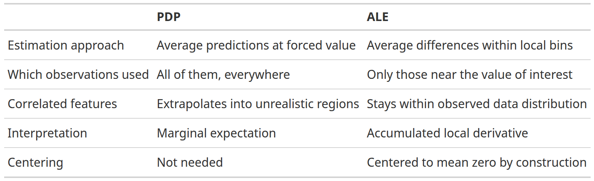

# IAML Unit 11: Discussion

## Announcements

- LLMs
- Full credit on permutation test question!
- Error on Neural networks quiz
- Penalty and optimizers in brulee
- Neural net winner

## Adam

- uses mini-batch, which works well with large n because computation of gradient over full n is very expensive
- it adapts learning rate per parameter, which is good for noisy or sparse gradients
- it has ~ 3x memory requirements because it stores two extra values for each parameter (their two moments ($\hat{m}$, running average of gradients); $\hat{v}$ — running average of squared gradients)


Adam has four hyperparameters:

Learning rate ($\alpha$) — The step size applied to each parameter update. Controls how far the optimizer moves in the direction of the gradient at each step. Typically set around 0.001. Too high and training is unstable; too low and it's slow.

$\beta_1$ — The exponential decay rate for the first moment estimate (the running average of the gradients themselves). Controls how much momentum carries forward from previous gradients. Default is 0.9, meaning 90% of the previous gradient direction is retained and 10% is the new gradient.

$\beta_2$ — The exponential decay rate for the second moment estimate (the running average of the squared gradients). Controls how quickly the optimizer adapts its step size per parameter based on recent gradient magnitudes. Default is 0.999. A high value means the per-parameter scaling changes slowly.

$\epsilon$ — A small constant added to the denominator to prevent division by zero when the second moment estimate is near zero. Default is around $10^{-8}$. Rarely tuned in practice.

## Penalty

https://github.com/tidymodels/brulee/blob/main/R/mlp-fit.R

```{r}
opt_uses_penalty <- function(opt) {
  vals <- c("ADAM", "ADAMw", "RMSprop", "Adadelta")
  opt %in% vals
}
```

## Neural Net winner


```{r}
library(tidyverse)
source("https://github.com/jjcurtin/lab_support/blob/main/print_kbl.R?raw=true")
read_csv(here::here("./application_assignments/competitions/2026_unit_10.csv"),
         show_col_types = FALSE) |>
  print_kbl()
```
## Bayesian Model Comparison

- What is the difference between Bayesian and Frequentist approaches?
  - NHST does not provide the probabilities of the null and alternative hypotheses.
    - That is what we want
    - NHST gives us the probability of our data given the null
  - NHST focuses on a point-wise comparison (no difference) that is almost never true.
  - NHST yields no information about the null hypothesis (i.e., when we fail to reject)
  - The inference depends on the sampling and testing intention (think about Bonferonni correction)
  
- Role of feature ablation
- How to interpret [results](https://jjcurtin.github.io/book_iaml/l11_explanation.html#bayesian-estimation-for-model-comparisons)
  - Credible intervals
  - Posterior probabilities for model comparisons
  - Use of ROPE

## PDP

- [How calculated and interpreted](https://christophm.github.io/interpretable-ml-book/pdp.html)

**The Algorithm**

For a feature of interest $X_s$ and all other features $X_c$ ("complement"):

1. Pick a grid of values for $X_s$ (e.g., 50 evenly spaced points across its range).
2. For each grid value $v$:
  - Take your full training dataset.
  - Force $X_s = v$ for every row (overwrite the column).
  - Run all $n$ rows through the model and get $n$ predictions.
  - Average those predictions. That's the PDP value at $v$.
3. Plot the grid values on the x-axis and the averaged predictions on the y-axis.


What problems would this approach have?

## ALE

- [How calculated and interpreted](https://christophm.github.io/interpretable-ml-book/ale.html)
- When to use?

**The Intuition**
ALE plots solve the correlated-feature problem in PDPs by changing what question they ask. Instead of "what happens when I force $X_s$ to equal $v$ across all observations?", ALE asks: "among observations where $X_s$ is already near $v$, how does a small change in $X_s$ affect predictions?"

**The Algorithm**

1. Divide the range of $X_s$ into $K$ small intervals (bins).
2. For each bin $[z_{k-1}, z_k]$:
  - Find all observations $i$ whose actual $X_s$ value falls in that bin.
  - For each such observation, compute two predictions: one with $X_s$ set to the bin's right edge $z_k$, one with $X_s$ set to the left edge $z_{k-1}$.
  - Average the differences (right − left) across those observations. This is the local effect for that bin.
3. Accumulate (sum) those local effects from the left edge of the feature's range up to $v$, and center the result so the mean ALE is zero.


**Why This Fixes the Correlation Problem**
The key move is only using observations that actually live near $v$ when estimating the effect at $v$. You're never forcing a feature into a region it doesn't naturally occupy in combination with the other features. The small nudge from $z_{k-1}$ to $z_k$ stays within the realistic joint distribution of the data.

## PDP vs. ALE




## Feature Importance Approaches

Model specific vs. agnostic

## Permutation Feature Importance

- [How does it work](https://jjcurtin.github.io/book_iaml/l11_explanation.html#permutation-feature-importance)
- What does it give you

## SHAP

### Overview


- Local vs. global importance
- Individual vs. categories of features
- Useful plots
  - Global importance
  - Sina plots
  - SHAP dependence plots
  - Individual predictions
  
### Computation

- [How does it work](https://christophm.github.io/interpretable-ml-book/shapley.html#general-idea)

**The Algorithm**
For a single observation and a single feature $j$: 

1. Consider every possible subset $S$ of features that excludes feature $j$.
2. For each subset, measure how much adding $j$ to that subset changes the prediction: $\hat{f}(S \cup {j}) - \hat{f}(S)$.
3. Average those marginal contributions, weighted so that each subset size gets equal representation.
4. The result is $j$'s Shapley value for that observation.

**A Concrete Example**
Say you have 3 features: age, income, education. To get the Shapley value for income for one specific person:

- Compute the marginal contribution of income when added to {} (empty set)
- Compute it when added to {age}
- Compute it when added to {education}
- Compute it when added to {age, education}
- Take the weighted average of all four

**The "Missing Features" Problem**
When evaluating $\hat{f}(S)$ — a subset that excludes some features — the model still needs values for those missing features. The standard approach is to marginalize over the training data: replace missing features with their values drawn from the training set, averaging over many such draws. This is what makes Shapley values expensive.


## Group discussion 

Get into small groups of 2-3. Think about one of the data sets we have worked with in class or your own! Create a research question you might ask using each of the following explanatory methods.

1. Bayesian model comparison
2. ALE or PDP plots
3. SHAP